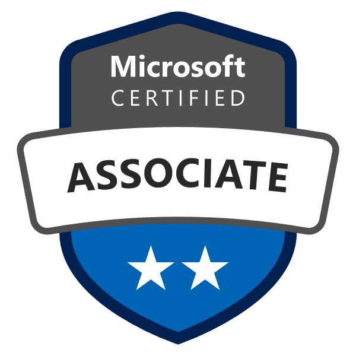
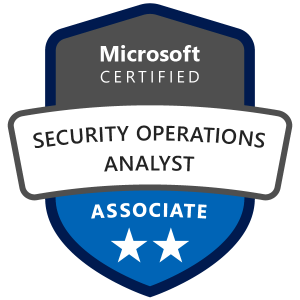

# Azure Security Portfolio

&nbsp;&nbsp;&nbsp;&nbsp;&nbsp;&nbsp;&nbsp;&nbsp;&nbsp;&nbsp;&nbsp;&nbsp;&nbsp;&nbsp;&nbsp;&nbsp;

This portfolio demonstrates practical, real-world Azure security skills across the end-to-end security lifecycle.  
It is designed to show competence in securing cloud identities, enforcing governance, building detections, responding to threats, and automating controls — exactly the responsibilities of an Azure Security Engineer.

---

## 🛠 What This Repo Shows

This repository covers key cloud security domains:

| Domain | What You’ll See |
|--------|-----------------|
| Identity Security | Azure AD hardening, MFA, Conditional Access |
| Privileged Access | PIM, secure admin design, just-in-time access |
| Cloud Posture | Defender for Cloud strategy, secure score, baselines |
| Governance | Azure Policy, landing zone design, RBAC |
| Detection Engineering | Microsoft Sentinel analytics, KQL, data connectors |
| Incident Response | SOAR Playbooks, investigation workflows |
| DevSecOps | Policy as code, CI/CD security automation |
| Capstone | End-to-end scenario from detection to response |

Each project folder has:
✔ a clear security problem description  
✔ implementation steps  
✔ outputs (queries, screenshots, diagrams)  
✔ lessons learned

---

## 📂 Folder Guide

1. `01-identity-security` – Secure Azure AD and identity entry points  
2. `02-privileged-access-security` – Protect highly privileged accounts  
3. `03-cloud-posture-management` – Establish strong cloud security posture  
4. `04-governance-and-landing-zones` – Prevent misconfiguration at scale  
5. `05-detection-engineering` – Build meaningful threat detections  
6. `06-incident-response-and-soar` – Investigate and automate response  
7. `07-devsecops-and-automation` – Automate security with code and pipelines  
8. `08-capstone-end-to-end-security` – Integrate detection → response → controls

---

## 🚀 How to Use This Repo

- Browse by domain to understand my approach
- Expand folders for documented projects
- Review KQL queries and playbooks
- See demonstrable outputs

---

## 🎯 Skills Demonstrated

- Azure AD hardening and Zero Trust  
- Microsoft Sentinel detection and hunting  
- SIEM + SOAR design patterns  
- Azure Policy and security governance  
- Defender for Cloud posture strategy  
- Automation with ARM/Bicep/Terraform
